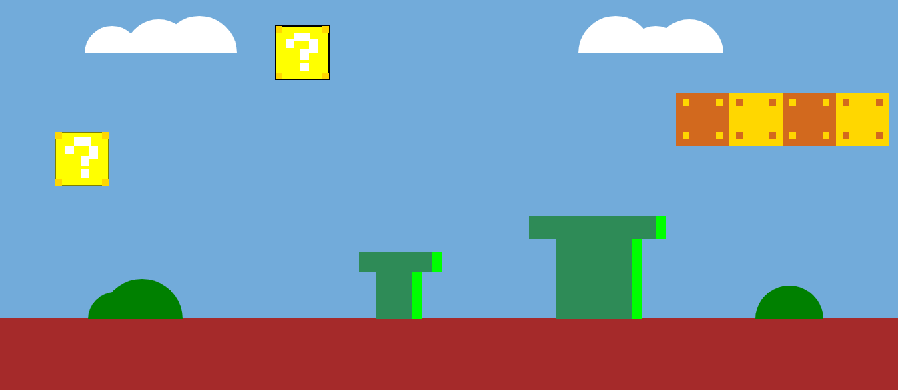

<h1> Canvas - Super Mario Background </h1>

 Este projeto tem que como objetivo adaptar o background do Super Mario.  A visão da adaptação geral:   

 
<h2> Blocos de interrogação </h2>

 Para fazer o bloco de interrogação foi utilizado o código fillRect(), e ajustando suas coordenadas e cores até chegar o mais próximo do original. Foram necessárias 3 camadas, 1° foi apenas a cor amarela e o contorno preto, a 2° foi o detalhe de ouro nas bordas e o 3° foi o sinal de interrogação.   

<h2> Blocos de moedas </h2>

 Assim como o anterior, o código predominante foi o fillRect e o modificando esteticamente.E foram necessárias apenas 2 camadas, 1° com a cor e a 2° os detalhes nos cantos.   

<h2> Canos </h2>

 Os canos também teve como prioridade o código fillRect. E para o brilho, foi necessário criar outro fillRect() com a lagura menor e destacar o canto dos canos.   

<h2> Nuvem </h2>

 Para criar a nuvem, foi utilizado o código arc, e em vez de multiplicar o valor de Math.PI por 2, ele foi dividido. Isso permite que a curva seja desenhada apenas até a metade do círculo, resultando em uma forma reta na parte inferior da nuvem.  

<h2> Arbusto </h2>

 Assim como o anterior, utilizei do mesmo código.  

<h2> Chão </h2>

 Para o chão foi necessário o código -> ctx.canvas.width = window.innerWidth;
ctx.canvas.height = window.innerHeight; Ele foi utilizado para ajustar às dimensões da janela do navegador, permitindo assim que o desenho no <canvas> ocupe toda a área visível.   

